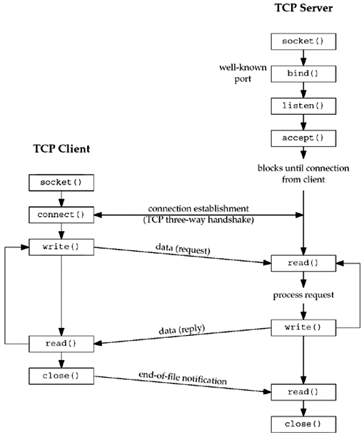
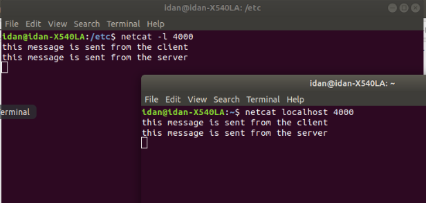

# Sockets Python Project - 
This project is aiming to explain how to use sockets. Later on it will be used for training Kubernetes. (k8s in short) 


## What is a socket? 
A socket is a connection between two connections. This is connection is based over the internet network, and is established between two computers - a local sender and a reciever, both are reffered as "host" . ( Host is the official definition, though the functions used to create web sockets use the definiton of send adn recieve. ) 

A socket can transfer data between two computers on the internet, however to be able to understand each other they need to have a set of rules. This "set" is called a protocol. Common protocol are - 
* FTP which stand for transfer protocol, and is used to transfer files between two computers. 
* SMTP for emails
* TCP which is used for transfering data on the internet. 
* SSH - which is used to securely connect to other machines and use terminal command on this machines. 

**For this project I will be using TCP protocol which transfers information between two computers, whilst checking that all information was transfered. This protocol is used in real life as the base of the interent with the HTTP protocol.**


### In more technical level - 
A socket is a connection between two softwares/computers/sides. It is used to send a message from one side to the other. 
A socket is used for client-serer methodology, where one side interacts with the other. Continuing with the above paragraph, the client and server and be on the same computer, and even not being named "client and server" . 

*Important to know - sockets can be used to create a ocnnection between two remote computers - or in the same computer itself! Yes yes - a socket can be used by two softwares running on the same computer in order to communicate!** 

Examples for sockets - 
* A client and server of a chat application - the client send th emssages to the chat, which sends a response back. ( Such as "message recieved" or even sneding it to other clients connected via sockets. ) 
* Docker socket - which is actually a socket created on my local machine which I send commands from my terminal and in turn the docker daemon read these commands, executes them and responds me back. 
* A connection between a database and a software - the database can be on a remote server or on the local machine. ( If it is on the machine then "localhost" or "127.0.0.1" can be used to tell the computer to connect to itself. ) 

### Sockets types - 
There are 4 type sof sockets - 
1. Stream Socket - this is a socket type which sends the messages and makes sure all sent packets are reserved in the sending order. ( e.g. packet in order 1-2-3 will be delivered in that order. If packet 2 is missing then the socket will ask the other host to resend packet 2 and then it will connect the packets in the right order. ) 
2. Datagram Socket - this socket accepts the packet but is not checking if they were delivered with no wrongs and is not checking asking for lost packets. This means that some part of the message might won't be delivered or will be delivered wrong! 
3. Raw Sockets - thes sockets are very "raw" meaning with no "rules" predefined. When using the above sockets then the system already puts headers and information on the transmit package for example IP address of the host, the protocol type used or the number of package from the total amount of packages. On the contrary raw socket has no headers or any other layer in the transmited package. The information trasnfered through the socket is empty and has no information added by default - and any extra information is added by the sfotware created the message. This protocol is used mainly by developers in order to invent new protocols. ( And in such case they need to choose which headers to add and what are the "set of rules" which will be used by the protocol of both client and server. ) 
4. Sequenced Packet Socket - This is protocol which is a combination of stream socket and datagram socket. It send the traffic with packets like TCP(based on stream socket) but doesn't check that all packages arrived, like in UDP(based on datagram socket) . 

The first 2 mentioned types are the most common - 
* Stream Sockets are usually used for TCP protocol, where the message needs to be completely recieved on the other side. 
* Datagram sockets are usually used for UDP protocol, where it can be fine to lost some of th epackages. For example when streaming a live-video - if some of hte packages are missing then you just see a black screen fro a moment and then keeps seeing the next packages with the continue of the video. ( Without the former lost part of the video. ) 

The later 2 are less used and will not be not discussed in this guide. 


## A background about using sockets in Linux OS - 
To view sockets open in a Linux machine there are two commands - ss (which stand for show sockets) and netcat. 

### ss command - 
```bash
$ ss #Will list all sockets currently used in the machine. This command will show all sockets including the addressesand port. 
NetidState      Recv-Q  Send-Q                                    Local Address:Port                                        Peer Address:Port                   
u_strESTAB      0       0                                    @/tmp/.X11-unix/X0 40215                                                  * 48765                  
u_strESTAB      0       0                                                     * 31289                                                  * 333332
#If it's long - you can use "grep" to filter it. 

idan@idan-X540LA:~$ ss -s #Will put a sum results. 
Total: 1231 (kernel 0)
TCP:   25 (estab 21, closed 0, orphaned 0, synrecv 0, timewait 0/0), ports 0

Transport Total     IP        IPv6
*	  0         -         -        
RAW	  1         0         1        
UDP	  7         5         2        
TCP	  25        24        1        
INET	  33        29        4        
FRAG	  0         0         0   


### More options - 
ss -t -a #Shows all open TCP sockets. 
ss -u -a #SHows all open UDP sockets. 
```

### netcat command - 
This is an important command to know when using Linux and networking. It allows to test connection to other servers. 

You can use netcat to telnet other servers - (Basically it act like telnet command - but more flexible. ) 
In this example I use netcat to connect to the google.com server. Then I can send an HTTP request - "GET / HTTP/1.1" and press double enter. This is a sign in the HTTP format for the end of the request message. Then my message is sent - and I get an answer. 
```bash
idan@idan-X540LA:/etc$ netcat google.com 80          ### -> Asking to connect to google.com to the socket open on port 80 . 
GET / HTTP/1.1              ### -> This line I typed by myself. 

HTTP/1.1 200 OK             ### -> This line is the response I got from google.com . 
Date: Sun, 26 Apr 2020 12:03:40 GMT
Expires: -1
Cache-Control: private, max-age=0
Content-Type: text/html; charset=ISO-8859-1
P3P: CP="This is not a P3P policy! See g.co/p3phelp for more info."
Server: gws
X-XSS-Protection: 0
X-Frame-Options: SAMEORIGIN
Set-Cookie: 1P_JAR=2020-04-26-12; expires=Tue, 26-May-2020 12:03:40 GMT; path=/; domain=.google.com; Secure
Set-Cookie: NID=203=BqvjnIyEGfxsuazVZIX7TenGh9dCWqPVJs2CsVtxzA2016fCnHBcLshzoCqnf5YLkKY8UDLQgX9jv1FhyWSUwwhXgyZPgX9Xt-i1DQQSRpCI2m0XWENL3CBU27GFnf-8Svo-q6xZk4MwM0P9wnm7zeV8PazVu-LxJZFo3-gz92M; expires=Mon, 26-Oct-2020 12:03:40 GMT; path=/; domain=.google.com; HttpOnly
Accept-Ranges: none
Vary: Accept-Encoding
Transfer-Encoding: chunked

5f20
<!doctype html><html dir="rtl" itemscope="" itemtype="http://schema.org/WebPage" lang="iw"><head>
```

Sending UDP message to a range of ports - 
```bash
netcat -u google.com 80-90 #This will send the message in UDP format to the port 80 until 90 . ( Each one will recieve a copy of the message. ) 
````

Scanning a range of ports to locate open sockets - 
```bash
idan@idan-X540LA:/etc$ netcat -z -v ynet.co.il 80-82
Connection to ynet.co.il 80 port [tcp/http] succeeded!
^C #Note taht some servers block response from other sockets, resulting netcat not to reposne, therefore I stopped it.

# -v = verbose = show more information in the returned result. 
# -z = means that it should scan the sockets - but won't send them message or information. 
```

Scanning a range of ports fro open sockets with known IP address - 
In the above example I typed the website address, and the netcat had to connect a DNS server in order to check its IP address. After getting the IP address it contacted the server. This can take time. 
But if I have the IP address then I can save this DNS check by using ```-n``` which says to netcat to connect to the IP address, without checking DNS servers. In this example I try to check for open port on my localhost with the IP address 127.0.0.1 which reffers to the local computer. 
```bash
#Trying to scan the sockets of a website, without specifying its IP address but using the -n argument which blocks netcat from checking the IP address via DNS servers. This will result an error since netcat can't find the IP address to contact hte server. ( It cannot contact the DNS server and to ask for transaltion. ) 
idan@idan-X540LA:/etc$ netcat -z -v -n ynet.co.il 8000-8002
netcat: getaddrinfo for host "ynet.co.il" port 8000: Name or service not known

#Now trying to check my localhost open sockets - using the IP address repressenting localhost. 
idan@idan-X540LA:/etc$ netcat -v -n 127.0.0.1 80-85
netcat: connect to 127.0.0.1 port 80 (tcp) failed: Connection refused
netcat: connect to 127.0.0.1 port 81 (tcp) failed: Connection refused
netcat: connect to 127.0.0.1 port 82 (tcp) failed: Connection refused
netcat: connect to 127.0.0.1 port 83 (tcp) failed: Connection refused
netcat: connect to 127.0.0.1 port 84 (tcp) failed: Connection refused
netcat: connect to 127.0.0.1 port 85 (tcp) failed: Connection refused
```

A note about the importance of -z is the fact that it doesn't have to check the DNS servers. It make the scan much faster, and also it can work when checking an internal network which has no access to DNS servers. 


### nc is an aliase for netcat - 
nc is a famous aliase for netcat, typing nc in the terminal will result the use of netcat function. 
```bash
nc google.com 80
netcat google.com 80 #Equivalent. 
```


## What is needed to create a socket? 
### IP address - 
Website address is not valid for making the socket! WHen surfing on the web what actually happens is that the browser connect to DNS server and translates the domain name to IP and then interacts with the ip. The ip address of a domain can be found with the command ```ping <domain>``` . 
This action can also be used to ping IP addresses to check whether there is a response from an IP address. Only IP address which can response - can created socket connections with your machine! If there is no response - then it means one of the two things: a) There is no server at the IP address. b) There is a server but if refuses to answer to you. (Whether the answer is "I can make connaction" or "connection cannot be made" . ) 
```
idan@idan-X540LA:/etc$ ping 127.0.0.1
PING 127.0.0.1 (127.0.0.1) 56(84) bytes of data.
64 bytes from 127.0.0.1: icmp_seq=1 ttl=64 time=0.059 ms
64 bytes from 127.0.0.1: icmp_seq=2 ttl=64 time=0.061 ms
^C
--- 127.0.0.1 ping statistics ---
2 packets transmitted, 2 received, 0% packet loss, time 1003ms
rtt min/avg/max/mdev = 0.059/0.060/0.061/0.001 ms
idan@idan-X540LA:/etc$ ping google.com
PING google.com (216.58.206.14) 56(84) bytes of data.
64 bytes from google.com (216.58.206.14): icmp_seq=1 ttl=54 time=64.4 ms
^C
--- google.com ping statistics ---
1 packets transmitted, 1 received, 0% packet loss, time 0ms
rtt min/avg/max/mdev = 64.416/64.416/64.416/0.000 ms
```

### Port - 
A port is used to identify a sppecific socket running in the computer. ( From all sockets running in the computer. ) 

It can be that a computer will run tens and hundreads of different socket. To be able to distinguish between each of them - each socket is running on a specific port. When connecting the server via socker - the port of the socket need to be reffered. The port will reffer to the socket running by a specific software. 

For example - the program which runs the SSH connection opens a socket by default all time in the OS. to access this specific socket you need to conenct to port 22 . WHen connecitng to this port all messages reffered to the computer will be directed to the SSH socket. ( And if you have the right SSH key then you establish a connection to the socket and can write() commands which the SSH client(which is actually a server) will execute on the computer. ) 


## Another ways you can describe and look a web socket - 

### Socket as a file - 
In Linux there is a methodology called "everything is a file" , meaning that any definition or process are represented as a file in the file system. So do sockets which are represented as files. These files can be read which is the process of "listening for a connection or message" and can be written by the client, which is the process of accepting / writing a message. 
*Example -* Many processes are having a file which represent the socket which accepts the mesages, and later they write to it the answers. On such exmaple is the docker daemon socket. When you send a docker command from the Terminal, you actually write it to the socket file, which is read by another program which is the docker daemon. 
* When wishing to run docker from an internal docker image inside the computer, you can mount the socker file, so that the same computer host's file is fed by the docker prgoram in the docker image. In that way, the docker image can access the docker information inside your computer and foe example see your images list, and build images which will be saved in your local machine. 

*Sometimes the conneciton acitons  within the socket are reffered as read() and write() . This is because you can reffer the socket as a "file" , though actually it is a stream. ( a file accept write and simoultanesouly sends back content from it. )*

### Client-Server socket - two main methodologies - 
2-tier - where the client connect directly to the server and the server directly responds to it. 
3-tier - in that case there is a middle software/server which processes the data. For exmaple, connecting via Kubernetes cluster, where the client connect to a deployment object, which in turn brings the messages to the container/pods/replica-sets etc... It is very likely that the middle software can manipulate or change some of the message in order to make it understandable by the client or server. 


## How to design a socket connection between a client and a server? ( The programing part. ) 

### A connection socket diagram - 
The following scheme shows a basic socket connection between a client and a server. This is a general idea, and may vary a little bit between different progamming languages. 

From the server's side - 
* It needs to create a socket object, which is a class used to listen to new connections. 
* The socket object need to bind an address. This is just a slang fro saying to choose the address and port which the connection will listen to. 
* Make the socket to accept connections - that basically means that the socket will be open to accept connection from a client. ( Or multiple clients... ) 
* From this points the server can accept conncetions, but at the first moment the socket is closed because no connection is created. 

From the clients side - 
* The client creates a socket object which will be used to connect to the server. ( Note that the socket object is used both for server and client, but it uses different functions - bind() and listen() ve. connect() respectively. ) 
* The connection() function is used to connect the client to the server. 
* The connection is done using a mechanism which can be used to make sure that the socket will be betwene the client and server, and no other pretender client or server can connect to the socket. *When using TCP socket then it uses hand-shake mechanism to verify that all later messages in the socket are made by the client and server.* 

And now when both client and server are connected - they can send messages to each other - 
* One is sending a message by "writing" it to the socket. 
* The other is "reading" the message. 
* When reading a message the software does so calculation or actions. 
* Later on, the receiver can send a message back to the sender - by "writing" to it. 
* The sender recieves the message, does calculation and "writes" a new message again. 
* This repeats until one of the sides wants to close the connection. 
* In all times, the socket is open, and waiting to read() new messages from the client/server. ( client waits for the server and the server wiats for the client. ) 

When the client wants to end the connection - 
* It sends an ending of conneciton message to the server. 
* The server is reading the message and closes the connection. 
* On the same time the client closes the connection. 
* Both client and server have closed the socket. 


**An important note -**
Which computer is the server and which is the client is only a relevant distinction during the initial configuration. After the connection is established, communication is exactly the same in both directions.




### Using netcat to open a port on the machine - ( This will create a TCP socket using netcat Linux command. ) 
netcat command can be used not only to connect to other socket/ports/machines - but also to oepn a port in the local computer. This is useful for diagnosting network issues. 

To open a port (= slang for opening a socket) from the machine - 
**Note - when opening a port netcat command will create a TCP socket! This socket is not encrypted so anyone can listen to its messages! **
```bash
netcat -l 4000 # This will open port 4000 . In other words you can say that netcat will listen on port 4000 . 
# you can choose any port you want. 
# -l = listen , means to open a port and listen to it. 

```
From this point any message which will be sent to port 4000 will be istened on the terminal and you can see the output. 

Now you can connect to this port with netcat from another machine - 
```bash 
netcat <address-of-my-machine> 4000 #Will try to connect on port 4000 . 
#in address you need to specify the DNS address fo your server, or the IP directly. ( And in such case you can also use -z to save DNS server check. ) 
```

In the above example, the listening computer is the server, and the computer contacting it is the client. Again, this is just for making the connection, after both machines/terminals connected - they play equivalent role as each one can write (=send)  and read (=recieve) . 

**And here is the example in reality -**
```bash
#Server side - 
idan@idan-X540LA:~$ netcat localhost 4000
this message is sent from the client #This message was recieved from the client. 
this message is sent from the server #This message I sent from the server to the client. This message was recieved on the client. 

#Client side - 
idan@idan-X540LA:/etc$ netcat -l 4000
this message is sent from the client #I sent this message from the client, and it appeared on the servers terminal. 
this message is sent from the server #I sent this message from the server, and it appeared here on the client's terminal. 
```

Example for a netcat socket connecton which I have made on a machine. Here I choose to connect to localhost, so the computer is the client connecting to itself as a server. On each terminal process I sent a message which apperead on the other terminal. ** 

#### Using netcat to transfer a file - 
In the above example I demonstrated how to make a simple socket using ```netcat``` command. There are two sides - a client and a server, and they succesfully transfered text messages over a TCP socket. 

In this example I will sned a file through a TCP socket made with ```netcat``` command. THis is pretty easy - as I take the above example code and just writes the output to a file using pipeline in Linux terminal. 

```bash
#Server side - 
netcat -l 4000 > myfile 
#This will make the terminal to become the server, and take all output of the command to the file "myfile" . 
#The output received by the netcat command is sent by the client. 
#The client will send the file - and then it will be put in "myfile" file. 

#Client side - 
idan@idan-X540LA:~$ netcat localhost 4000
hello world  # -> This is my output, which will eventually will create a text file. But the output can be of a full file content. 

#This will open the socket to the server. 
#From here I just need to print the conent of the file. Then the content will be
```


### Common objects used for making socket conneciton in different programming languages - 
These are exmaples of objects which can be found in many programming languages. They are used to store properties about the socket and to configure it. ( This example is reffering to C programming language. ) 

These can be seen in many ways - 
* Socket - this object is the one actually doing the connection. 
* socket address (socket pointer) - this object hold the information of the connection server - IP address and port. 
```
struct sockaddr {
   unsigned short   sa_family;
   char             sa_data[14];
};
#This is an example for a socket address object. 
#sa_family = socket address family = type of protocol used to connect to the socket. For exmaple - 
##	AF_INET = IPv4 addresses. 
##	AF_INET6 = IPv6 addresses. 
##	AF_UNIX = unix domain port = a socket file in the local system = This is actually an address on the file system where the socket file lies - for example docker socker or mysql socket. ( " /var/run/mysqld/mysqld.sock " ) 
#sa_data = the IP address , the file path, the port etc... 
```
full list of sa_family options - 
```
  Name                   Purpose                 
   AF_UNIX, AF_LOCAL      Local communication              
   AF_INET                IPv4 Internet protocols        
   AF_INET6               IPv6 Internet protocols
   AF_IPX                 IPX - Novell protocols
   AF_NETLINK             Kernel user interface device    
   AF_X25                 ITU-T X.25 / ISO-8208 protocol 
   AF_AX25                Amateur radio AX.25 protocol
   AF_ATMPVC              Access to raw ATM PVCs
   AF_APPLETALK           Appletalk                      
   AF_PACKET              Low level packet interface 
```
Sometime it can be reffered in other languages as socket_add_in - Again, it's the same idea - the socket's family, and the address of the socket. 
```
struct sockaddr_in {
   short int            sin_family;
   unsigned short int   sin_port;
   struct in_addr       sin_addr;
   unsigned char        sin_zero[8];
};
```

* hostent - host entity - this object stores the host (=server) details. 
```
struct hostent {
   char *h_name; 
   char **h_aliases; 
   int h_addrtype;  
   int h_length;    
   char **h_addr_list
	
#define h_addr  h_addr_list[0]
};
```
Meaning of the fields - 
```
Attribute 	Values		 	Description
h_name 			ti.com etc. 	It is the official name of the host. For example, tutorialspoint.com, google.com, etc.
h_aliases 		TI 				It holds a list of host name aliases.
h_addrtype 		AF_INET 		It contains the address family and in case of Internet based application, it will always be AF_INET.
h_length 		4 				It holds the amount of octats of the IP address, which is 4 for IPv4 , or 6 for IPv6 .
h_addr_list 	in_addr 		For Internet addresses, the array of pointers h_addr_list[0], h_addr_list[1], and so on, are points to structure in_addr.

NOTE − h_addr is defined as h_addr_list[0] to keep backward compatibility.
```


* Servent object - Now this is something cachy so read carefully. 
#### Services file / Servent object - 
Every Unix like has a services file which lists all ports and protocols needed to make socket fro different services. THe file is located at etc/service. (to print it type - ```echo /etc/service```) 
The aim of this file is to write all types of recognized ports and their socket protocols. For example you can find the port and protocol used fro e-mail (SMTP port 21) or ssh (SSH port 22) etc... THIS FILE IS NOT USED TO REGISTER EACH SERVICE IN THE SYSTEM! Its role is to write the list of the servcies which can *possibly* use these ports so you won't catch them. HOWEVER IT DOESN'T PROMISE OR "CATCH" THIS PORT FOR THE SERVICE. It means that any service can use the ports and sockets in the computer freely without any relation to this file, and that the file won't block it from using this port. 

**So what is the meaning of this file?** It is a map/list of ports which in high chance are or will be used by programms installed on the computer. However, 

**So why to use this file?**
1. It can give you a list of the ports which are *probbably* being used by other programms. 
2. It can be used to know which port and socket details are commonly used for specific 

Example of the file output - ( I just took the first lines as it's long! ) 
```bash 
idan@idan-X540LA:/etc$ cat services 
# Network services, Internet style
#
# Note that it is presently the policy of IANA to assign a single well-known
# port number for both TCP and UDP; hence, officially ports have two entries
# even if the protocol doesn't support UDP operations.
#
# Updated from http://www.iana.org/assignments/port-numbers and other
# sources like http://www.freebsd.org/cgi/cvsweb.cgi/src/etc/services .
# New ports will be added on request if they have been officially assigned
# by IANA and used in the real-world or are needed by a debian package.
# If you need a huge list of used numbers please install the nmap package.

tcpmux		1/tcp				# TCP port service multiplexer
echo		7/tcp
echo		7/udp
discard		9/tcp		sink null
discard		9/udp		sink null
systat		11/tcp		users
daytime		13/tcp
daytime		13/udp
netstat		15/tcp
qotd		17/tcp		quote
msp		18/tcp				# message send protocol
msp		18/udp
chargen		19/tcp		ttytst source
chargen		19/udp		ttytst source
ftp-data	20/tcp
ftp		21/tcp
fsp		21/udp		fspd
ssh		22/tcp				# SSH Remote Login Protocol
```

In many proggraming languages you can query the ***service file*** for the suggested port and protocol used to make a socket for a specific use. The functions and object used for these queries are called - **servent**
```
struct servent {
   char  *s_name;       /* official service name */
   char **s_aliases;    /* alias list */
   int    s_port;       /* port number */
   char  *s_proto;      /* protocol to use */
}
```
Meanings - 
```
Attribute 	Values 	Description
s_name 		http 	This is the official name of the service. For example, SMTP, FTP POP3, etc.
s_aliases 	ALIAS 	It holds the list of service aliases. Most of the time this will be set to NULL.
s_port 		80 		It will have associated port number. For example, for HTTP, this will be 80.
s_proto 	TCP / UDP	It is set to the protocol used. Internet services are provided using either TCP or UDP.
```
For example - you can query what should be used for internet surfing **service**? which will result - 
* port 80 
* HTTP protocool for application layer protocol
* TCP network protocol for socket level. 
* It will also say that the service name is generally called "internet" 

**To sum up -** some programming languages can user servent() functions nad object. These are used to query the ***services file*** and show the results of the desired service definitions on network and application levels. 

Useful refference - 
* General infromation about sockets (in C language) - 
https://www.tutorialspoint.com/unix_sockets/index.htm
* netcat command examples and explanations - 
https://www.digitalocean.com/community/tutorials/how-to-use-netcat-to-establish-and-test-tcp-and-udp-connections-on-a-vps
* Services file - 
http://man7.org/linux/man-pages/man3/getservent.3.html 
https://www.lifewire.com/what-is-etc-services-2196940


